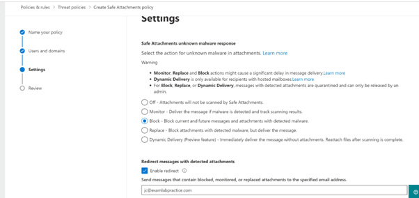
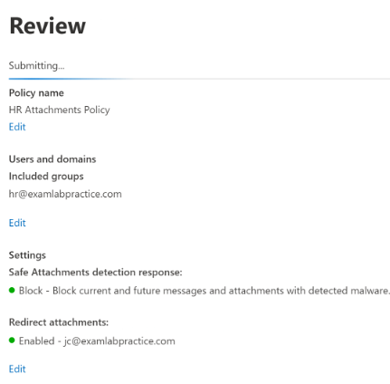
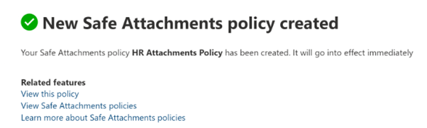

# Safe-Attachments-Policy-using-Defender-for-Office-365
Create a Safe Attachment Policy for HR. Set to Block and redirect to admin email address

<h2>Description</h2>
Lab consists of a create Safe Attachments Policy by using Microsoft Defender for Office 365. Safe Attachments protection for email messages is controlled by Safe Attachments policies. 
<br />


<h2>Environments Used </h2>
- <b>Microsoft 365 Defender Portal </b>

<h2>Prerequisites</h2>

-<b> Safe-Attachment policy can be created or modified by anyone assigned the following roles:
 - Member of the Organization Management 
 - Security Administrator
 - Global Administrator
 </b>
- <b> Licenses: Microsoft 365 Advanced Threat Protection Plan 1 or 2 OR Microsoft Defender for Office 365 plan 1 and plan 2</b>

<h2>Program walk-through:</h2>

<h3>Steps: </h3>

1. Go to Microsoft 365 Defender --> Policies --> select ‘Threat policies’
2. Select ‘safe attachments’ --> create new --> give name
3. Select group ‘HR’ 
4. ‘block- block current and future messages’ and enable redirect & give email id
5. Review & create

<h3>Screenshots:</h3>

<p align="center">
Threat Policies:  <br/>

<br />
<br />

<br />
<br />
Give a Name : <br/>

<br />
<br />
Select 'HR' group: <br/>

<br />
<br />
Policy Settings: <br/>

<br />
<br />
Review & Create: <br/>

<br />
<br />
Result: <br/>

<br />
<br /> 

</p>

<!--
 ```diff
- text in red
+ text in green
! text in orange
# text in gray
@@ text in purple (and bold)@@
```
--!>
